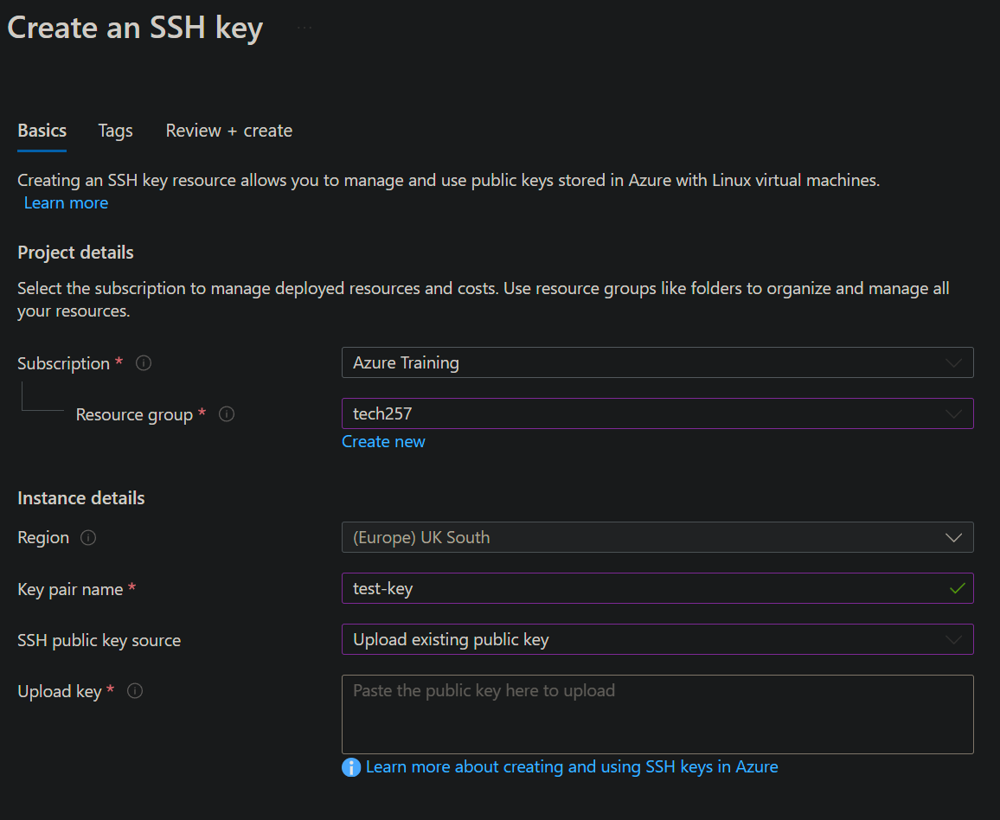
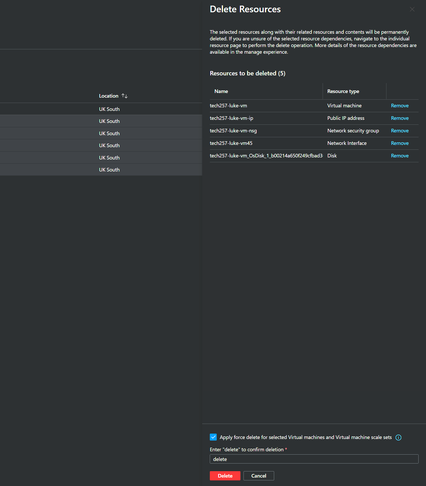

# Microsoft Azure

### Logging in to Azure

Go to `portal.azure.com` and log in with your Microsoft account.

### Creating an SSH key on Azure

In a terminal, generate an SSH key pair using the keygen command.

`ssh-keygen -t rsa -b 4096 -C "example@email.com"`

Copy the **PUBLIC** key by entering `cat luke-az-key.pub` and copying the contents.

Go to Azure and search for the 'SSH Keys' service.

Click 'Create' and fill out the form making sure to use the same key pair name as you used in the terminal.

Select 'Upload existing public key' for the SSH public key source and paste in the contents of the public key from the terminal.

Click 'Review + create' and create your SSH key.

### Create a VM
                                
Navigate to the 'Virtual Machines' resource either by searching for it or selecting it from the Home page or elsewhere.

Click 'Create' and select 'Azure virtual machine' from the dropdown.

Give your virtual machine a suitable name, e.g. `tech257-luke-vm`.

Select `No infrastructure redundancy required' when selecting 'Availability options'.

When selecting an image, select `Ubuntu Pro 18.04 LTS - x64 Gen2`. Click 'See all sizes' and search for it if it doesn't appear initially.

When selecting the size, select `Standard_B1s - 1 vcpu, 1 GiB memory`. Click 'See all sizes' and search for it if it doesn't appear initially.

Change username from the default value of `azureuser` to lower the risk of being hacked.

Choose 'Use existing key stored in Azure' as the 'SSH public key source' so we can use the SSH key that has been added to Azure.

Select your SSH key from the list.

In 'Select inbound ports' add HTTP if necessary.

Navigate to 'Disks' and change OS disk type to `Standard SSD` to save on costs.

Go to 'Tags' and add a tag with name 'Owner' and a value of your name.

Now, click 'Review + create', double check you have configured the VM correctly, and then create it.

### SSH to VM

Once your VM has finished deploying, go to your VM resource.

Click 'Connect' and select 'Connect' from the dropdown.

Select 'Native SSH'.

On the right side, under 'Copy and execute SSH command', add the path to your SSH key on your local machine, e.g. `~/.ssh/ssh_key`

Copy the command and run it in a terminal on your local machine.

Enter 'yes' if necessary to continue connecting.

### Delete a VM

Go to your list of resources in Azure and locate your virtual machine.

Select it and any other related resources that you also want to delete.

Click 'Delete' 

Check the box to 'Apply force delete' and then confirm deletion.

